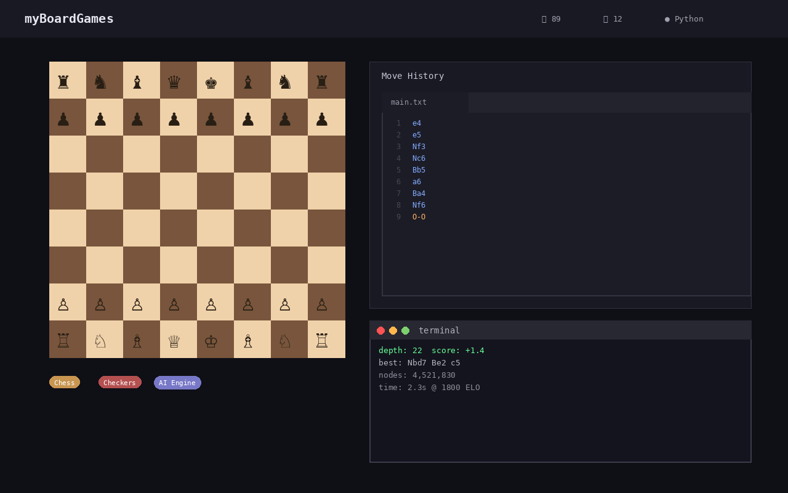

# myBoardGames

Practice board games on your phone — Chess, Checkers, Sudoku, Blockudoku, and more.
No accounts, no internet, no ads. Just play.

**For**: Anyone who wants to practice logic skills or pass the time with quick games.

## Download

Get the latest APK from the [Releases](https://github.com/stennu718/myBoardGames/releases) page.

Or build it yourself:
```bash
git clone https://github.com/stennu718/myBoardGames.git
cd myBoardGames
./gradlew assembleDebug
```

## Games included

- **Chess** — Classic strategy game
- **Checkers** — Jump and capture
- **Sudoku** — Number puzzles with multiple difficulty levels
- **Blockudoku** — Block placement puzzle
- **Puzzle Rush** — Timed challenges
- **Daily challenges** — New puzzle every day

## Features

- Works completely offline
- No sign-up required
- Dark mode support
- Progress tracking and statistics
- Free and open source

## Screenshot



## Technical Highlights

- **Language**: Kotlin + Jetpack Compose
- **Architecture**: Modular (11 feature modules + core modules)
- **Build**: Gradle with Kotlin DSL
- **Target**: Android 14+
- **Offline**: No internet required, no accounts, no ads
- **CI/CD**: GitHub Actions

## Project Structure

```
app/                  # Main application module
core/                 # Shared modules (database, UI, ads, sound, review, cloud)
feature/              # Game modules (chess, checkers, sudoku, blockudoku, etc.)
```

## License

MIT
